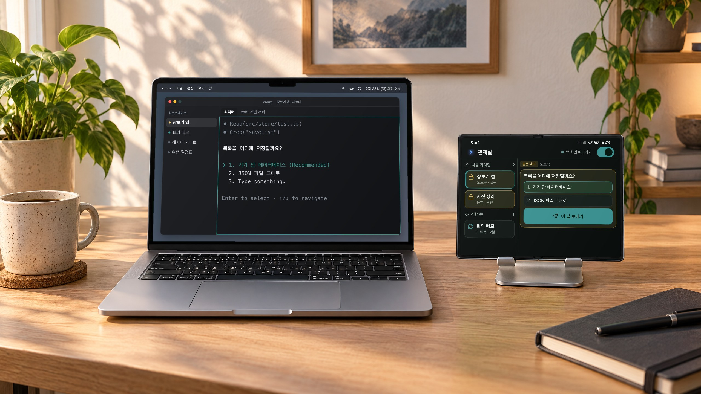
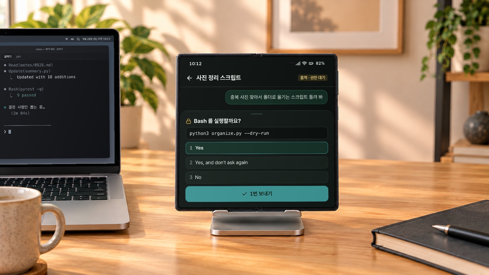
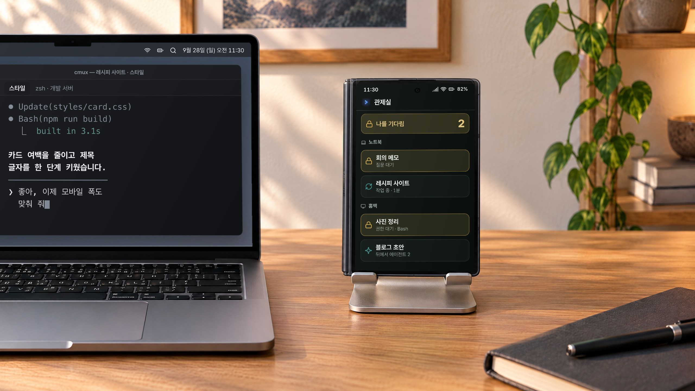
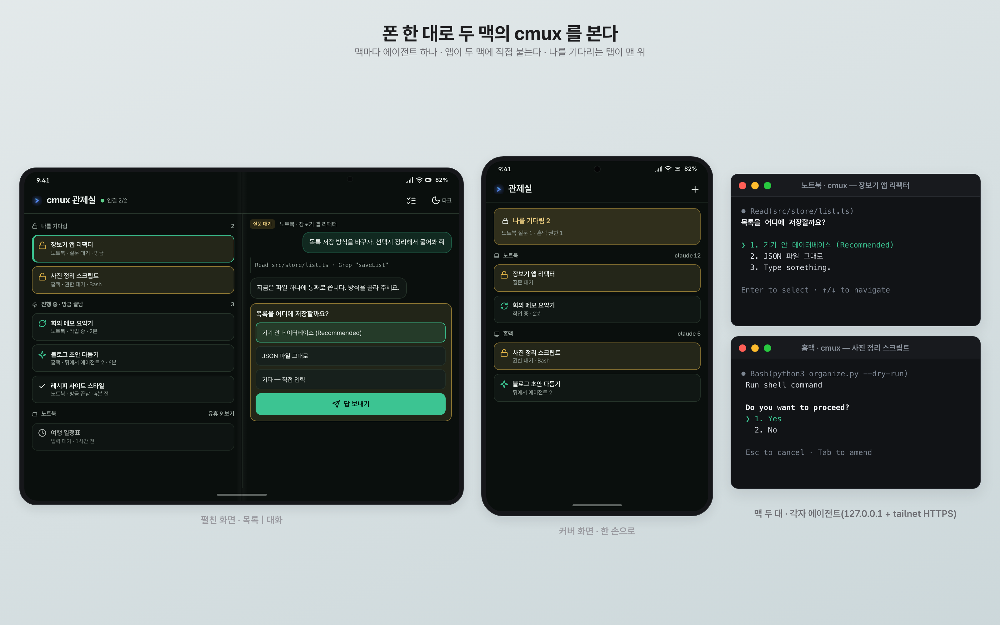
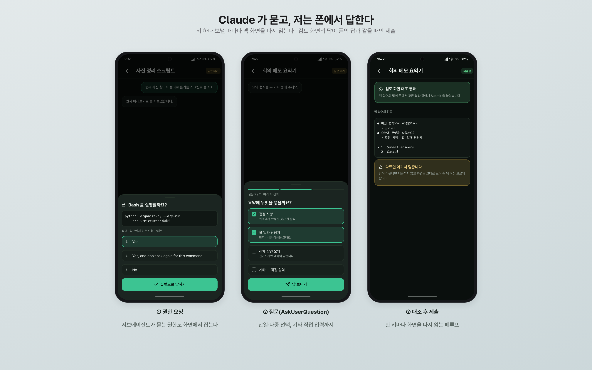
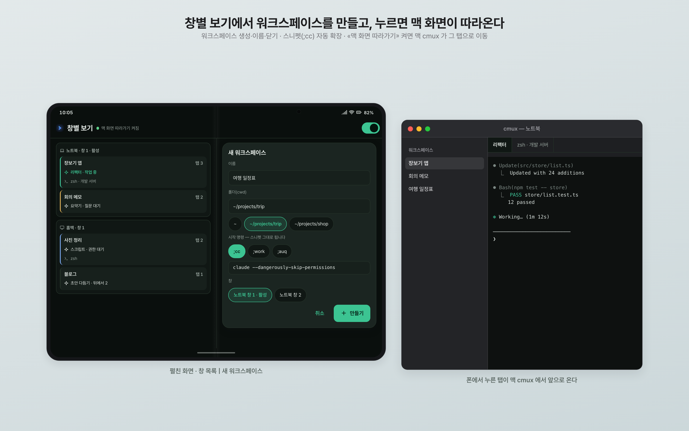
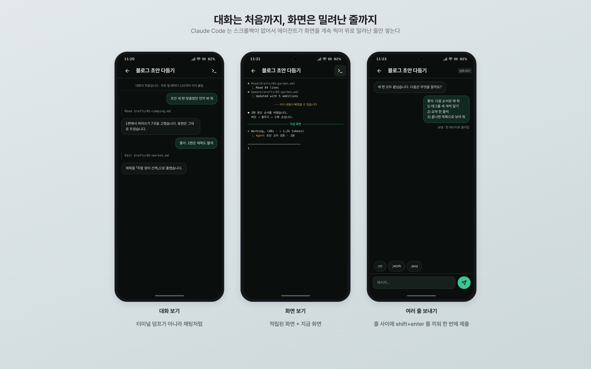
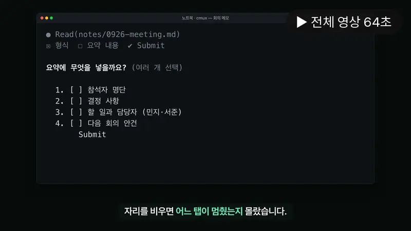
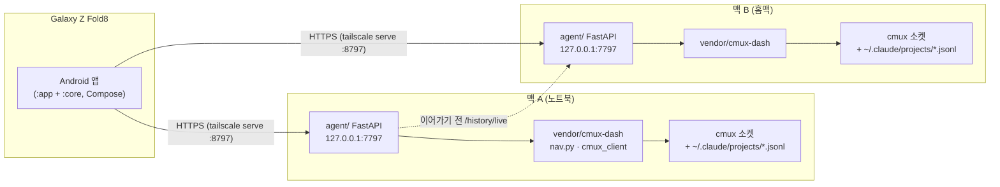

# cmux 모바일 관제실 (cmux-mobile-remote)

폰에서 두 맥의 cmux(Claude Code 세션 수십 개가 도는 터미널)를 보고, 권한 요청·질문에 답하고, 메시지를 보내는 안드로이드 앱과 맥 에이전트입니다.

> **English** — A native Android app plus a small per-Mac FastAPI agent that lets me watch and drive every Claude Code session running in cmux on two Macs from a Galaxy Z Fold8.
> It lists all claude tabs by state (waiting on me, running, background agents, idle), shows the transcript as a chat and the raw screen, and answers permission prompts and AskUserQuestion from the phone with a re-read-the-screen-every-key loop.
> Each Mac runs its own agent bound to 127.0.0.1 and exposed only inside a Tailscale tailnet via `tailscale serve`; there is no hub, so one Mac going to sleep does not take the other down.

동작 확인: Galaxy Z Fold8 (Android 17) · macOS 26

## 왜 만들었나

저는 10년 가까이 아이폰을 쓰다가 갤럭시 Z 폴드8로 바꿨습니다. 맥과 이어지는 기능이 아쉬워서, 필요한 연동을 Claude Code 와 함께 하나씩 직접 만들고 있습니다. 이 저장소는 그중 하나입니다.

평소 노트북과 집에 있는 맥, 두 대에서 cmux 를 띄워 두고 Claude Code 세션을 여러 개 돌립니다. 자리를 비우면 어느 탭이 권한을 기다리는지, 어느 세션이 질문을 던지고 멈춰 있는지 알 수가 없었습니다. Claude Code 의 Remote Control 은 세션 하나를 다루는 도구라서, 저는 «cmux 전체»를 폰에서 쥐고 싶었습니다. 그래서 맥마다 작은 에이전트를 붙이고, 폰 앱이 두 맥에 직접 붙어 탭 목록·대화·화면을 보고 답까지 하도록 만들었습니다.

제 폰과 제 맥 두 대에서 매일 쓰는 개인 도구이고, 범용 제품은 아닙니다.

## 실제로 이렇게 씁니다


맥 옆에 폰을 세워 두고 «나를 기다림» 탭을 누르면 → 맥 cmux 가 그 탭으로 넘어오고, 질문에는 폰에서 바로 답합니다.


노트북으로 다른 일을 하는 중에 홈맥 세션이 권한을 기다리면 → 자리를 옮기지 않고 폰에서 1 번(Yes)으로 답합니다.


폰을 접어 스탠드에 두면 → 커버 화면에서 두 맥 중 어느 탭이 멈춰 있는지 한눈에 봅니다.

책상 사진은 AI로 만든 배경이고, 화면은 설명용 목업을 합성했습니다.

## 스크린샷


화면은 설명용 목업입니다.


화면은 설명용 목업입니다.


화면은 설명용 목업입니다.


화면은 설명용 목업입니다.

<!-- VIDEO:START -->
### 홍보 영상

[](https://pub-81d14e6ebfb841109968e9c0ee057d1b.r2.dev/android-mac-lab/videos/cmux-mobile-remote/cmux-mobile-remote_16x9.mp4)

▶ [가로 16:9 · 64초](https://pub-81d14e6ebfb841109968e9c0ee057d1b.r2.dev/android-mac-lab/videos/cmux-mobile-remote/cmux-mobile-remote_16x9.mp4) · ▶ [세로 9:16 · 62초](https://pub-81d14e6ebfb841109968e9c0ee057d1b.r2.dev/android-mac-lab/videos/cmux-mobile-remote/cmux-mobile-remote_9x16.mp4) — 영상 속 화면은 설명용 목업이고, 책상 사진은 AI로 만든 배경입니다.
<!-- VIDEO:END -->

## 기능

- **두 맥의 claude 탭을 한 화면에** — 상태별로 묶어 보여 줍니다: 권한 대기 · 질문 대기(자물쇠) → 작업 중 · 워크플로 · 뒤에서 에이전트 진행 · 방금 끝남(10분) → 입력 대기 · 유휴. «나를 기다림»은 두 맥을 합쳐 맨 위에 둡니다.
- **대화 보기** — `.jsonl` 대화 기록을 채팅처럼 읽습니다. 위로 밀면 이전 120개씩 자동으로 이어 붙어 대화의 처음까지 갑니다.
- **화면 보기 + 화면 적립** — Claude Code 는 alt-screen 이라 터미널 스크롤백이 없습니다. 에이전트가 claude 탭 화면을 계속 읽어 위로 밀려난 줄만 파일에 쌓고, 폰은 «적립된 화면 + 지금 화면»을 이어 보여 줍니다. 놓친 구간은 «사이 내용이 빠졌을 수 있습니다»로 드러냅니다.
- **권한 요청·AskUserQuestion 에 폰에서 답하기** — 권한 요청의 정본은 화면이라(서브에이전트의 요청은 대화 기록에 안 남습니다) 화면을 파싱합니다. 키 하나 보낼 때마다 화면을 다시 읽고, 마지막 검토 화면의 답이 폰에서 고른 답과 같을 때만 제출합니다. 다르면 멈추고 화면을 그대로 보여 줍니다.
- **메시지 보내기** — 여러 줄 메시지는 줄 사이에 `shift+enter` 를 끼워 한 메시지로 들어가게 합니다. 허용한 키(esc·enter·방향키·tab 등)만 보낼 수 있습니다.
- **창별 보기 · 워크스페이스** — 창 › 워크스페이스 › 탭 트리를 보고, 폰에서 워크스페이스를 만들고(이름·폴더·시작 명령·창·그룹) 이름을 바꾸거나 닫습니다. 닫을 때는 함께 종료되는 claude 탭 목록을 먼저 보여 줍니다. 셸 탭에도 명령을 보낼 수 있습니다.
- **스니펫** — Raycast 스니펫 내보내기 파일을 에이전트에 두면 폰 입력칸에서 키워드(`;cc` 등)가 자동으로 펼쳐집니다.
- **맥 화면 따라가기** — 켜 두면 폰에서 탭을 누를 때 그 맥의 cmux 가 해당 탭으로 넘어갑니다. 데스크톱에서 일하면서 폰을 리모컨처럼 쓸 때 씁니다.
- **이어가기** — 세션 id 로 `claude --resume` 을 새 워크스페이스에서 띄웁니다. 이 맥·상대 맥에서 이미 돌고 있으면 막습니다. 기록 앱([fold-claude-history](https://github.com/joonlab/fold-claude-history))과 딥링크(`cmuxremote://`, `cchistory://`)로 이어집니다.
- **폴드 화면** — 펼치면 목록|대화 두 칸, 가운데 레일을 끌어 폭 조절·접기, 핀치로 글자 크기, 질문 시트 접기, 테마 3단(자동·라이트·다크).

## 구조



- 허브가 없습니다. 앱이 두 맥의 에이전트에 각각 직접 붙어서, 노트북이 덮여도 홈맥 쪽은 그대로 보입니다. 두 에이전트의 버전이 어긋나면 같은 화면이 다르게 보일 수 있어서 모든 응답에 `machine`·`version` 을 싣습니다.
- 세션↔탭 조인과 상태 판정은 제 다른 저장소인 웹 대시보드 [joonlab/cmux-state-dashboard](https://github.com/joonlab/cmux-state-dashboard) 의 `nav.py` 를 그대로 import 해서 씁니다(`agent/dash.py` 가 유일한 입구). 이 저장소에는 그 코드를 넣지 않았습니다.

| 폴더 | 내용 |
|---|---|
| `agent/server.py` | API — 목록·대화·화면·프롬프트 읽기, 보내기·키·답하기·워크스페이스·따라가기·이어가기 |
| `agent/transcript.py` | `.jsonl` → 채팅 항목. 뒤에서부터 조각으로 읽고 바이트 커서로 페이지를 나눔 |
| `agent/screenprompt.py` | 화면에서 권한·질문·검토 프롬프트를 파싱하고 지문(`sig`)을 만듦 |
| `agent/screenlog.py` | 화면 적립(프레임 겹침으로 밀려난 줄 수 계산, 탭당 4MB 상한) |
| `agent/tree.py` | 창 › 워크스페이스 › 탭 트리 |
| `agent/resume.py` | 이어가기 판정(이 맥·상대 맥에 살아 있나, 작업 폴더가 있나) |
| `android/core` | 연결·JSON·테마·글자 크기·분할 레일·아이콘·Pretendard |
| `android/app` | 관제실 앱 화면 |

## 준비물

- macOS + [cmux](https://github.com/manaflow-ai/cmux) (소켓 제어를 password 모드로)
- Claude Code (cmux 탭 안에서 실행)
- Python 3.12 이상, pm2(선택, 상시 실행용)
- Tailscale — 폰과 맥이 같은 tailnet 에 있어야 합니다
- 안드로이드 폰(minSdk 30). 저는 폴드8에서만 확인했습니다
- 앱 빌드: JDK 21, Android SDK(compileSdk 36)
- 맥은 한 대여도 됩니다

## 설치

### 1. 맥 에이전트 (맥마다)

```bash
git clone https://github.com/joonlab/cmux-mobile-remote
cd cmux-mobile-remote

# 관제실 모듈(웹 대시보드 저장소)을 vendor/cmux-dash 에 받는다.
# 제가 확인한 커밋은 fix/restore-gates-and-question-status 브랜치의 cb64880 입니다.
git clone -b fix/restore-gates-and-question-status \
  https://github.com/joonlab/cmux-state-dashboard vendor/cmux-dash

python3 -m venv agent/.venv
agent/.venv/bin/pip install -r agent/requirements.txt
agent/.venv/bin/pip install -r vendor/cmux-dash/requirements.txt   # 관제실 쪽 의존성

cp agent/.env.example agent/.env      # 값을 맥에 맞게 고친다
set -a; . agent/.env; set +a
pm2 start agent/ecosystem.config.js --update-env
# pm2 없이: agent/.venv/bin/python -m uvicorn server:app --app-dir agent --host 127.0.0.1 --port 7797

# tailnet 에만 HTTPS 로 내보낸다(카페 와이파이 같은 LAN 에는 안 열린다)
tailscale serve --bg --https=8797 http://127.0.0.1:7797
curl -s http://127.0.0.1:7797/api/v1/health
```

cmux 소켓 비밀번호는 관제실 모듈이 cmux 설정 파일에서 읽습니다. 코드나 환경변수에 적지 않습니다.

### 2. 안드로이드 앱

```bash
cp android/local.properties.example android/local.properties
# cmr.machines 에 맥 주소를 적는다 — key|이름|https://MagicDNS-호스트명:8797 을 쉼표로
cd android && ./dev.sh run      # 빌드 → adb 설치 → 실행 (./dev.sh build 는 빌드만)
```

`cmr.machines` 는 `local.properties`, `-Pcmr.machines=…`, 환경변수 `CMR_MACHINES` 순서로 찾아 빌드 때 `BuildConfig` 에 들어갑니다. 앱 코드에는 주소가 없습니다.

## 설정

에이전트(`agent/.env.example`)

| 변수 | 기본값 | 뜻 |
|---|---|---|
| `CMR_MACHINE` | 호스트 이름 | 이 맥의 key. 앱 `cmr.machines` 의 key 와 맞춘다(`laptop`·`home`) |
| `CMR_SEND` | `off` | `off` 읽기 전용 · `allowlist` 허용 목록과 에이전트가 만든 워크스페이스만 · `on` 전부 |
| `CMR_SEND_ALLOW` | 비어 있음 | allowlist 모드에서 쓰기를 허용할 surface UUID(쉼표) |
| `CMR_PEER_URL` / `CMR_PEER_NAME` | 비어 있음 / `다른 맥` | 상대 맥 에이전트 주소·이름. 이어가기 전에 «저쪽에서 돌고 있나»를 묻는다 |
| `CMR_SCREENLOG` | `on` | 화면 적립 켜기/끄기 |
| `CMR_DATA` | `agent/data` | 감사 로그·화면 적립·스니펫 폴더(git 에 안 올라감) |
| `CMR_CLAUDE_DIR` | `~/.claude` | Claude Code 설정 폴더 |
| `CMR_HAND_LIB` | `$CMR_CLAUDE_DIR/scripts/hand-lib.py` | 선택. 두 맥 사이 세션 소유 확인용 개인 도구 경로. 파일이 없으면 그 검사만 건너뜁니다(`agent/resume.py` 머리말 참고) |
| `CMR_NAMES_FILE` | `session-names.json` | 선택. `CMR_CLAUDE_DIR` 안의 세션 이름표 파일 |

스니펫: Raycast 에서 «Export Snippets» 한 JSON 을 `agent/data/snippets.json` 에 두면 됩니다. 비밀값이 든 스니펫이 있으면 그대로 폰에 실리니, 싣기 싫은 건 파일에서 빼 두세요.

## 위협 모델과 안전장치

이 앱은 남의 터미널에 글을 쓰는 도구입니다. 그래서 이렇게 막았습니다.

- **인증은 Tailscale 망에 맡깁니다.** 에이전트 자체에는 로그인이 없습니다. 대신 `127.0.0.1` 에만 바인딩하고 `tailscale serve` HTTPS 로만 내보냅니다. `0.0.0.0` 으로 띄우면 같은 LAN 의 누구나 붙을 수 있으니 그렇게 하지 마세요.
- **쓰기는 기본으로 꺼져 있습니다**(`CMR_SEND=off`). `on` 이면 폰에서 셸 명령을 보내거나 `claude --dangerously-skip-permissions` 로 새 세션을 띄울 수 있습니다. tailnet 에 들어온 기기라면 누구든 그렇게 할 수 있다는 뜻입니다.
- **표적은 UUID 로만.** 빈 surface 는 거부합니다(비어 있으면 cmux 가 호출자 자신의 탭으로 보내기 때문). 대상은 지금 살아 있는 claude 탭이나 트리에 있는 터미널 탭이어야 하고, 브라우저 탭은 안 됩니다.
- **모든 쓰기는 `agent/data/audit.jsonl` 에 남깁니다**(보낸 글은 앞 80자 미리보기와 해시).
- `ctrl+c` 는 셸 탭에만 보낼 수 있습니다(claude 탭에서 두 번이면 종료되므로).

## 알려진 한계

- 막힌 탭이 생겼을 때 폰 푸시 알림은 아직 없습니다. 앱을 열어야 보입니다.
- 권한 요청 시트의 폰 화면은 실제 권한 대기 탭에서 끝까지 확인하지 못했습니다. 권한 답하기 API 는 테스트 세션에서, 질문 답하기는 테스트 세션과 실사용에서 확인했습니다.
- 화면 파서는 Claude Code 2.1.28x 의 화면 모양에 맞춰져 있습니다. TUI 문구나 배치가 바뀌면 깨질 수 있습니다(파서 회귀 테스트가 그 대비입니다).
- 화면 적립은 에이전트가 화면을 주기적으로 읽는 방식이라, 한 번에 많이 밀려나면 사이가 빕니다. 그 자리는 표시해서 드러냅니다.
- 상태 판정은 cmux-state-dashboard 에 의존합니다. 그쪽을 함께 받아야 동작하고, 그쪽 브랜치가 바뀌면 동작도 바뀝니다.
- 폴드8 외의 폰, 한 대짜리 구성은 제가 직접 써 보지 않았습니다.
- 저장소에 테스트는 에이전트(파이썬) 쪽만 있습니다. 앱은 폰에서 손으로 확인했습니다.

## 만든 과정

Claude Code 와 함께 약 사흘 동안 만들었습니다. 첫날 저녁에 시작해 다음 날 새벽까지 커밋 25개쯤, 사흘째까지 39개였습니다(기록 앱으로 분리한 부분 포함). 설계 단계에서 네 가지를 먼저 정했습니다: 네이티브 안드로이드, 맥마다 에이전트(허브 없음), 웹 대시보드 코드 재사용, Tailscale 망 신뢰.

기억에 남는 삽질:

1. **여러 줄 메시지가 첫 줄에서 제출됐습니다.** cmux 로 보내는 글 안의 줄바꿈은 브래킷 페이스트로 감싸도, paste-buffer 로 붙여도 전부 Enter 로 바뀌었습니다. 방법 네 가지를 실측한 끝에, 줄마다 따로 보내고 줄 사이에 `shift+enter` 키를 끼우는 방식으로 풀었습니다.
2. **«화면 보기가 짧다».** 스크롤백을 늘리면 될 줄 알았는데, Claude Code 는 alt-screen TUI 라 스크롤백이 아예 없었습니다. 그래서 에이전트가 화면을 계속 찍고, 이전 프레임과 겹치는 부분을 찾아 위로 밀려난 줄만 적립하게 했습니다. 에이전트 CPU 는 0.3~0.4% 정도였습니다.
3. **자물쇠가 안 뜨던 이유는 두 겹이었습니다.** 권한을 묻던 쪽이 백그라운드 서브에이전트라 요청이 본 대화 기록에 없었고, 한편 `ps -E` 가 환경변수까지 명령줄에 붙이는 바람에 프로세스 236개 중 183개를 claude 로 잘못 세고 있었습니다(바로잡고 나니 53개). 그 뒤로 권한 요청은 화면을 정본으로 봅니다.
4. **같은 상태 표가 다섯 벌이었습니다.** 파이썬·JS·HTML·Swift(메뉴바)·Kotlin(폰)에 상태 순서가 따로 적혀 있어 한쪽만 고치면 조용히 어긋났습니다. 폰은 서버가 내려 주는 `statusOrder` 를 따르도록 바꿨습니다.

질문 답하기 테스트는 모두 따로 만든 테스트 워크스페이스와 테스트용 claude 세션에서만 했고, 실제로 쓰던 탭에는 보내지 않았습니다.

## 테스트

```bash
agent/.venv/bin/pip install pytest
agent/.venv/bin/python -m pytest agent/tests          # test_transcript 는 vendor/cmux-dash 가 있어야 돈다
```

테스트용 화면 표본(`agent/tests/fixtures/`)은 실제 테스트 세션에서 뜬 화면 모양을 유지하되, 경로와 문구는 가상의 것으로 바꿨습니다.

## 관련 프로젝트

- 허브: https://github.com/joonlab/android-mac-lab
- 웹 대시보드(상태 판정 원본): https://github.com/joonlab/cmux-state-dashboard

## 라이선스

MIT — [LICENSE](LICENSE). 글꼴·아이콘 등 제3자 자료는 [THIRD_PARTY.md](THIRD_PARTY.md) 에 적었습니다.
